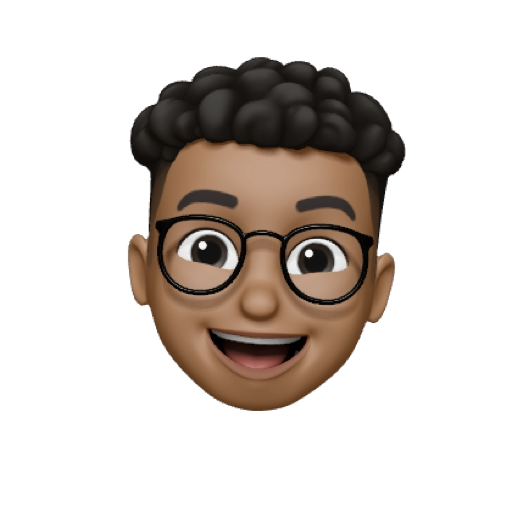

 

### Eduardo Guette Portfolio

Este repositorio contiene el código fuente y los archivos relacionados con mi sitio web portfolio. Aquí encontrarás información sobre mi experiencia, habilidades y proyectos destacados. ¡Bienvenido/a!

Acerca de mí
Soy Eduardo Guette, un Ing. Civil apasionado/a por el desarrollo de software y UX/UI. A lo largo de mi carrera, he adquirido experiencia en:

- Desarrollo de aplicaciones con React
- Utilizo HTML semantico y CSS para crear sitios web responsive
- Utilizo JavaScript para crear aplicaciones web interactivas
- Para manejar el estado de mi aplicación en proyectos pequeños utilizo Context API y para proyectos grandes Redux, React Query o Zustand. Aunque este ultimo se ha vuelto mi favorito.😍
- Para el manejo de rutas utilizo React Router
- Para prototipar utilizo Figma.

Mi objetivo principal es enriquecer tus proyectos con mis conocimientos. Me encanta enfrentar nuevos desafíos y aprender constantemente para mejorar mis habilidades.

Características del Sitio Web
Mi sitio web portfolio tiene las siguientes características principales:

Diseño atractivo: El sitio web presenta un diseño moderno y atractivo que resalta mi trabajo y habilidades de manera efectiva.

Navegación intuitiva: Los visitantes pueden navegar fácilmente por las diferentes secciones del sitio web y acceder a la información que necesitan de manera intuitiva.

Sección de proyectos: En esta sección, presento algunos de mis proyectos destacados, junto con detalles sobre el objetivo, tecnologías utilizadas y los resultados obtenidos.

Información sobre mí: Aquí, los visitantes encontrarán una descripción detallada sobre mi experiencia, educación, certificaciones y cualquier otra información relevante que destaque mis logros y habilidades.

Si deseas realizar alguna mejora o cambio, siéntete libre de hacer un fork de este repositorio y enviar tus propias contribuciones a través de solicitudes de extracción. ¡Aprecio cualquier aporte!

Contacto
Si tienes alguna pregunta o sugerencia relacionada con mi sitio web portfolio o cualquier otro tema, no dudes en contactarme enviándome un correo electrónico a eduardoguette@gmail.com.

¡Espero que disfrutes navegando por mi portafolio!
